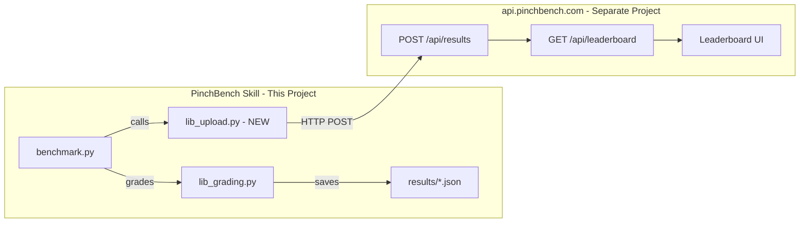

# Leaderboard Integration Architecture

## Overview

This document defines the architecture for sending benchmark results from PinchBench to a centralized leaderboard server. The server implementation lives in a **separate project**, so this plan focuses on:

1. **API Contract** - The schema and endpoints the client expects
2. **Client Module** - `lib_upload.py` implementation in this project
3. **Authentication Strategy** - How to prevent spam/tampering
4. **Data Model** - What we send and how it's structured

---

## System Architecture



---

## API Contract

### Endpoint: `POST /api/results`

**Base URL**: `https://api.pinchbench.com` (configurable via env var `PINCHBENCH_SERVER_URL`)

#### Request Headers

| Header                 | Required | Description                               |
| ---------------------- | -------- | ----------------------------------------- |
| `Content-Type`         | Yes      | `application/json`                        |
| `X-PinchBench-Token`   | Yes      | Auth token for submission                 |
| `X-PinchBench-Version` | No       | Client version for compatibility tracking |

#### Request Body Schema

```json
{
  "submission_id": "uuid-v4",
  "timestamp": "2024-01-15T10:30:00Z",
  "client_version": "1.0.0",
  "model": "anthropic/claude-sonnet-4",
  "provider": "anthropic",
  "run_id": "0001",
  "openclaw_version": "0.5.0",
  "total_score": 8.5,
  "max_score": 10.0,
  "tasks": [
    {
      "task_id": "task_01_calendar",
      "score": 0.85,
      "max_score": 1.0,
      "grading_type": "automated",
      "timed_out": false,
      "execution_time_seconds": 45.2,
      "breakdown": {
        "date_correct": 1.0,
        "time_correct": 1.0,
        "attendee_present": 0.5,
        "title_correct": 1.0
      },
      "notes": ""
    }
  ],
  "usage_summary": {
    "total_input_tokens": 12500,
    "total_output_tokens": 8200,
    "total_requests": 45
  },
  "metadata": {
    "os": "darwin",
    "python_version": "3.11.0",
    "suite": "all"
  }
}
```

#### Response - Success (201 Created)

```json
{
  "status": "accepted",
  "submission_id": "uuid-v4",
  "rank": 15,
  "percentile": 85.2,
  "leaderboard_url": "https://pinchbench.com/leaderboard#uuid-v4"
}
```

#### Response - Validation Error (422)

```json
{
  "status": "error",
  "error": "validation_failed",
  "details": ["tasks[0].score must be between 0 and max_score"]
}
```

#### Response - Auth Error (401)

```json
{
  "status": "error",
  "error": "unauthorized",
  "message": "Invalid or missing authentication token"
}
```

---

## Authentication Strategy

### API-Key Registration + Claim (Recommended for MVP)

Moltbook-style flow: clients request a new API key from the server, then the
key must be **claimed** by a human. No keypair or signature scheme.

1. Client registers at `api.pinchbench.com/register` (or via API)
2. Server returns a **new API key** + **claim URL**
3. Client stores the key (`PINCHBENCH_TOKEN` env var or `--token` flag)
4. Token is sent in `X-PinchBench-Token` header for uploads
5. Human claims the key later (mechanism handled server-side)

**Pros**: Simple, immediate use, familiar for agents, no cryptographic complexity
**Cons**: Tokens can be shared/leaked; requires server-side claim + rotation policy

### MVP Decision: **API-Key Registration + Claim** (no signatures)

---

## Client Module: lib_upload.py

### Interface Design

```python
def upload_results(
    results_path: Path,
    *,
    server_url: str | None = None,
    token: str | None = None,
    timeout_seconds: float = 30.0,
    dry_run: bool = False,
) -> UploadResult:
    """
    Upload benchmark results to the PinchBench leaderboard server.

    Args:
        results_path: Path to the JSON results file
        server_url: Override server URL (default: from env or api.pinchbench.com)
        token: Auth token (default: from PINCHBENCH_TOKEN env var)
        timeout_seconds: HTTP request timeout
        dry_run: If True, validate but don't actually send

    Returns:
        UploadResult with status, rank, and leaderboard URL

    Raises:
        UploadError: If upload fails (network, auth, validation)
    """
```

### Configuration Resolution Order

1. Explicit function arguments
2. Environment variables (`PINCHBENCH_SERVER_URL`, `PINCHBENCH_TOKEN`)
3. Config file `.pinchbench/config.json` (auto-created by `--register`)
4. Built-in defaults

### Error Handling Strategy

| Error Type          | Handling                                     |
| ------------------- | -------------------------------------------- |
| No token configured | Warn and skip upload (don't fail benchmark)  |
| Network error       | Retry up to 3 times with exponential backoff |
| Server 5xx          | Retry with backoff                           |
| Client 4xx          | Fail immediately with clear message          |
| Invalid JSON        | Fail immediately (bug in our code)           |

---

## Data Model Details

### What We Currently Have (benchmark.py lines 310-334)

```python
aggregate = {
    "model": args.model,
    "run_id": run_id,
    "timestamp": time.time(),
    "suite": args.suite,
    "tasks": [
        {
            "task_id": result["task_id"],
            "status": result["status"],
            "timed_out": result["timed_out"],
            "execution_time": result["execution_time"],
            "transcript_length": len(result["transcript"]),
            "usage": result.get("usage", {}),
            "workspace": result["workspace"],
            "grading": grades_by_task_id[result["task_id"]].to_dict(),
        }
        for result in results
    ],
}
```

### What We Add in lib_upload.py

| Field                               | Source                     | Notes                           |
| ----------------------------------- | -------------------------- | ------------------------------- |
| `submission_id`                     | Generated in lib_upload    | UUID v4                         |
| `client_version`                    | Read from `pyproject.toml` | `project.version`               |
| `provider`                          | Parse from model           | Split on `/`                    |
| `openclaw_version`                  | Shell command              | `openclaw --version`            |
| `total_score`                       | Computed                   | Sum of task scores              |
| `max_score`                         | Computed                   | Sum of max scores               |
| `usage_summary.total_input_tokens`  | Aggregate from tasks       | Sum `usage.input_tokens`        |
| `usage_summary.total_output_tokens` | Aggregate from tasks       | Sum `usage.output_tokens`       |
| `usage_summary.total_requests`      | Aggregate from tasks       | Sum `usage.request_count`       |
| `metadata.system.*`                 | Stdlib + platform-specific | See `collect_system_metadata()` |

### System Metadata Collection

We can collect rich system information using Python's stdlib modules. This helps with:

- **Performance analysis**: Does benchmark performance correlate with hardware?
- **Compatibility tracking**: Which environments are running PinchBench?
- **Debugging**: When submissions behave unexpectedly, what's the system profile?

#### Available System Info (stdlib only)

| Field            | Source                             | Example                            |
| ---------------- | ---------------------------------- | ---------------------------------- |
| `os`             | `sys.platform`                     | `"darwin"`, `"linux"`, `"win32"`   |
| `os_release`     | `platform.release()`               | `"6.5.0-44-generic"`               |
| `os_version`     | `platform.version()`               | `"#44~22.04.1-Ubuntu SMP"`         |
| `architecture`   | `platform.machine()`               | `"x86_64"`, `"arm64"`, `"aarch64"` |
| `python_version` | `platform.python_version()`        | `"3.11.4"`                         |
| `python_impl`    | `platform.python_implementation()` | `"CPython"`, `"PyPy"`              |
| `cpu_count`      | `os.cpu_count()`                   | `8`                                |
| `hostname_hash`  | `hash(platform.node()) % 10000`    | `4829` (anonymized)                |

#### Linux-Specific (via /proc)

On Linux systems, we can read additional hardware details:

| Field                 | Source          | Example                 |
| --------------------- | --------------- | ----------------------- |
| `cpu_model`           | `/proc/cpuinfo` | `"Intel Core i7-12700"` |
| `memory_total_gb`     | `/proc/meminfo` | `32.0`                  |
| `memory_available_gb` | `/proc/meminfo` | `24.5`                  |

#### macOS-Specific (via sysctl)

| Field                | Source                               | Example          |
| -------------------- | ------------------------------------ | ---------------- |
| `cpu_brand`          | `sysctl -n machdep.cpu.brand_string` | `"Apple M1 Pro"` |
| `memory_total_gb`    | `sysctl -n hw.memsize` / 1e9         | `32.0`           |
| `cpu_cores_physical` | `sysctl -n hw.physicalcpu`           | `10`             |
| `cpu_cores_logical`  | `sysctl -n hw.logicalcpu`            | `10`             |

#### Implemented Metadata Schema

```json
{
  "metadata": {
    "suite": "all",
    "system": {
      "os": "linux",
      "os_release": "6.5.0-44-generic",
      "os_version": "#44~22.04.1-Ubuntu SMP",
      "architecture": "x86_64",
      "python_version": "3.11.4",
      "python_implementation": "CPython",
      "cpu_count": 8,
      "cpu_model": "Intel(R) Core(TM) i7-12700 @ 2.10GHz",
      "memory_total_gb": 32.0,
      "memory_available_gb": 24.5,
      "hostname_hash": 4829
    }
  }
}
```

#### Implementation Helper

```python
import os
import platform
import re
import sys
from pathlib import Path
from typing import Any


def collect_system_metadata() -> dict[str, Any]:
    """Collect system metadata for submission."""
    meta = {
        "os": sys.platform,
        "os_release": platform.release(),
        "os_version": platform.version(),
        "architecture": platform.machine(),
        "python_version": platform.python_version(),
        "python_implementation": platform.python_implementation(),
        "cpu_count": os.cpu_count(),
        "hostname_hash": hash(platform.node()) % 10000,  # Anonymized
    }

    # Linux-specific
    if sys.platform == "linux":
        meta.update(_collect_linux_info())

    # macOS-specific
    elif sys.platform == "darwin":
        meta.update(_collect_macos_info())

    return meta


def _collect_linux_info() -> dict[str, Any]:
    """Collect Linux-specific system info from /proc."""
    info: dict[str, Any] = {}

    # CPU model from /proc/cpuinfo
    try:
        cpuinfo = Path("/proc/cpuinfo").read_text()
        match = re.search(r"model name\s*:\s*(.+)", cpuinfo)
        if match:
            info["cpu_model"] = match.group(1).strip()
    except OSError:
        pass

    # Memory from /proc/meminfo
    try:
        meminfo = Path("/proc/meminfo").read_text()

        total_match = re.search(r"MemTotal:\s*(\d+)\s*kB", meminfo)
        if total_match:
            info["memory_total_gb"] = round(int(total_match.group(1)) / 1e6, 1)

        avail_match = re.search(r"MemAvailable:\s*(\d+)\s*kB", meminfo)
        if avail_match:
            info["memory_available_gb"] = round(int(avail_match.group(1)) / 1e6, 1)
    except OSError:
        pass

    return info


def _collect_macos_info() -> dict[str, Any]:
    """Collect macOS-specific system info via sysctl."""
    import subprocess
    info: dict[str, Any] = {}

    def sysctl(key: str) -> str | None:
        try:
            result = subprocess.run(
                ["sysctl", "-n", key],
                capture_output=True,
                text=True,
                timeout=5,
            )
            return result.stdout.strip() if result.returncode == 0 else None
        except (subprocess.SubprocessError, FileNotFoundError):
            return None

    # CPU brand string
    cpu_brand = sysctl("machdep.cpu.brand_string")
    if cpu_brand:
        info["cpu_model"] = cpu_brand

    # Memory
    mem_bytes = sysctl("hw.memsize")
    if mem_bytes:
        info["memory_total_gb"] = round(int(mem_bytes) / 1e9, 1)

    # CPU cores
    physical = sysctl("hw.physicalcpu")
    if physical:
        info["cpu_cores_physical"] = int(physical)

    logical = sysctl("hw.logicalcpu")
    if logical:
        info["cpu_cores_logical"] = int(logical)

    return info
```

#### Privacy Considerations

- **NO PII**: No usernames, full hostnames, or IP addresses
- **Anonymized hostname**: Hash mod 10000 allows correlation without identification
- **Optional fields**: System info collection should gracefully degrade if access is denied
- **Opt-out**: Consider a `--no-system-info` flag for privacy-conscious users

---

### Fields to Exclude from Upload

- `workspace` - Local path, not useful for leaderboard
- `transcript_length` - Can keep or drop, low value
- Full transcripts - Privacy/size concerns

---

## Integration with benchmark.py

### Current Flow (simplified)

```python
# Line 330-334
output_path = output_dir / f"{run_id}_{model_slug}.json"
output_path.write_text(json.dumps(aggregate, indent=2))
logger.info("Saved results to %s", output_path)
if args.no_upload:
    logger.info("Skipping upload (--no-upload)")
else:
    from lib_upload import upload_results, UploadError
    try:
        result = upload_results(output_path)
        if result.rank is not None:
            logger.info("Uploaded to leaderboard: rank #%s", result.rank)
        if result.leaderboard_url:
            logger.info("View at: %s", result.leaderboard_url)
    except UploadError as e:
        logger.warning("Upload failed: %s", e)
```

### Proposed Changes

```python
# After saving results locally
output_path.write_text(json.dumps(aggregate, indent=2))
logger.info("Saved results to %s", output_path)

if args.no_upload:
    logger.info("Skipping upload (--no-upload)")
else:
    from lib_upload import upload_results, UploadError
    try:
        result = upload_results(output_path)
        logger.info("Uploaded to leaderboard: rank #%d", result.rank)
        logger.info("View at: %s", result.leaderboard_url)
    except UploadError as e:
        logger.warning("Upload failed: %s", e)
        # Don't fail the benchmark - results are saved locally
```

---

## Implementation Phases

### Phase 1: Client Foundation

- [x] Create `lib_upload.py` with core upload function
- [x] Add `UploadResult` and `UploadError` dataclasses
- [x] Implement configuration resolution (env vars)
- [x] Add payload transformation (current format → API format)

### Phase 2: Integration

- [x] Wire up upload call in `benchmark.py`
- [ ] Add `--token` CLI argument as alternative to env var
- [ ] Add `--dry-run` mode to validate without sending
- [ ] Implement retry logic with exponential backoff

### Phase 3: Robustness

- [ ] Add request signing preparation (future-proofing)
- [ ] Add offline queue for failed uploads
- [ ] Add `pinchbench upload <file>` standalone command
- [ ] Add upload status to results JSON (uploaded: true/false)

---

## Environment Variables

| Variable                    | Required | Default                      | Description                |
| --------------------------- | -------- | ---------------------------- | -------------------------- |
| `PINCHBENCH_TOKEN`          | Yes\*    | None                         | Authentication token       |
| `PINCHBENCH_SERVER_URL`     | No       | `https://api.pinchbench.com` | Server base URL            |
| `PINCHBENCH_UPLOAD_TIMEOUT` | No       | `30`                         | Request timeout in seconds |

\*Required only if uploading (not with `--no-upload`)

---

## Security Considerations

1. **Token Storage**: Recommend env var, never commit to repo
2. **HTTPS Only**: Reject non-HTTPS server URLs in production
3. **Payload Size**: Cap at 1MB to prevent abuse
4. **Rate Limiting**: Server should enforce per-token limits
5. **No Secrets in Payload**: Don't include API keys, paths, etc.

---

## Open Questions

1. **Should we include model pricing info?** Could enable cost-per-score metrics
2. **Retry queue persistence?** If upload fails, save to `~/.pinchbench/pending/`?
3. **Anonymous submissions?** Allow without token but mark as unverified?
4. **Batch uploads?** Support uploading multiple result files at once?

---

## Dependencies

No new dependencies required for MVP:

- `urllib.request` - HTTP client (stdlib)
- `json` - Serialization (stdlib)
- `uuid` - Submission ID generation (stdlib)

Optional for better UX:

- `requests` - Already implied by existing code patterns
- `rich` - Progress bar for upload (if not already used)

---

## Next Steps

1. Review and approve this architecture
2. Define API contract in OpenAPI spec (server project)
3. Implement `lib_upload.py` in this project
4. Update `benchmark.py` to call upload
5. Test against staging server
6. Document in README
